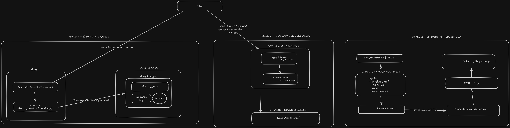

# IWallet Architecture: Trustless ZK Agentic Authorization
**Architect:** George-Goldman

## Executive Summary
IWallet is a trustless, zero-knowledge authorization layer built on the Sui network. It enables autonomous AI agents to execute high-frequency decentralized finance (DeFi) operations on behalf of users without ever taking custody of user funds or requiring human-in-the-loop transaction signing. By combining Groth16 zero-knowledge proofs over the BN254 curve, Trusted Execution Environments (TEEs), and Sui's Programmable Transaction Blocks (PTBs), IWallet achieves true cryptographic sovereignty.

---

## Architecture Flow

*(Note: The diagram above outlines the cryptographic genesis and autonomous intent execution flow between the Next.js client, the TEE agent, and the Sui Move smart contract.)*

---

## 1. The Threat Model & Non-Custodial Genesis
Traditional "Web3 AI Agents" fall into the Custodial Trap: the backend server generates the agent's private keys, fundamentally creating a bank where users must trust the developers not to steal their funds. 

IWallet solves this by enforcing **Client-Side Genesis**:
1. The secret witness ($w$) is generated locally in the user's browser.
2. The browser computes the identity hash using a ZK-friendly function: $IdentityHash = Poseidon(w)$.
3. The user submits a transaction to Sui, permanently locking the $IdentityHash$ inside an `IIdentity` Shared Object.
4. Only after the blockchain vault is locked does the client delegate $w$ to the agent via an encrypted tunnel.

Because the user generated the initial witness, they maintain ultimate sovereignty. If the agent infrastructure goes offline, the user can generate their own ZK proofs locally to recover their funds.

## 2. The Secure Execution Enclave (TEE)
While the smart contract acts as the vault, the off-chain agent acts as the authorized proxy. To protect $w$ from host-level extraction (e.g., a compromised VPS or malicious cloud provider), the IWallet agent daemon is designed to run inside a Trusted Execution Environment (TEE), such as AWS Nitro Enclaves or Intel SGX. 

The TEE serves as a cryptographic black box. It holds $w$ in encrypted memory, observes market conditions, and calculates the Groth16 proofs locally. The TEE never leaks $w$ to the internet; it only broadcasts mathematically sound, computationally unforgeable proofs.

## 3. Cryptographic Intent Binding & Scalar Field Safety
To prevent a malicious actor from intercepting a valid ZK proof and altering the trade parameters (e.g., changing the recipient address), IWallet utilizes strict **On-Chain Intent Binding**.

The execution parameters (`nonce`, `amount`, `recipient`) are serialized and hashed to create an `intent_hash`, which is passed into the ZK circuit as a public input. The Move smart contract independently recalculates this hash during the transaction and asserts equality, guaranteeing the proof was generated specifically for the requested execution.

### Overcoming the BN254 Overflow
A critical architectural challenge in integrating Keccak256 with Groth16 is scalar field overflow. The BN254 curve operates on a 254-bit prime field ($r$). Because Keccak outputs 256 bits, roughly 14% of legitimate intent hashes will exceed $r$, causing the on-chain verifier to fatally abort.

**The Solution:** Rather than implementing prohibitively expensive BigNum modulo arithmetic in the Move Virtual Machine, IWallet applies a highly optimized bitmask. Both the off-chain TypeScript daemon and the on-chain Move contract apply a bitwise `AND` operation (`0x1F`) to the most significant byte of the intent hash. This truncates the top bits, strictly bounding the hash below the scalar field limit while maintaining 253 bits of collision resistance. Furthermore, the Move contract reverses the resulting byte array to Little-Endian (LE) to perfectly synchronize with Sui's underlying Arkworks cryptography backend.

## 4. Gas Abstraction and PTB Composability
IWallet eliminates the need for ephemeral wallets to hold network gas. By utilizing Sui's Programmable Transaction Blocks (PTBs) and Sponsored Transactions, the architecture achieves a frictionless agentic UX.

1. **The Sponsor:** A designated Gas Station signs the PTB to cover all network fees.
2. **The Atomic Trade:** Within a single PTB, the agent calls `withdraw_with_proof` to extract funds from the `IIdentity` shared object, routes those funds directly into a DEX (e.g., Cetus or Bluefin) for a swap, and routes the output asset back into the `IIdentity` bag storage via `receive_coin`. 

Because the `IIdentity` is a Shared Object rather than an Address-Owned Object, it acts as a universally composable, dumb vault that authenticates via pure mathematics rather than traditional Ed25519 signatures.