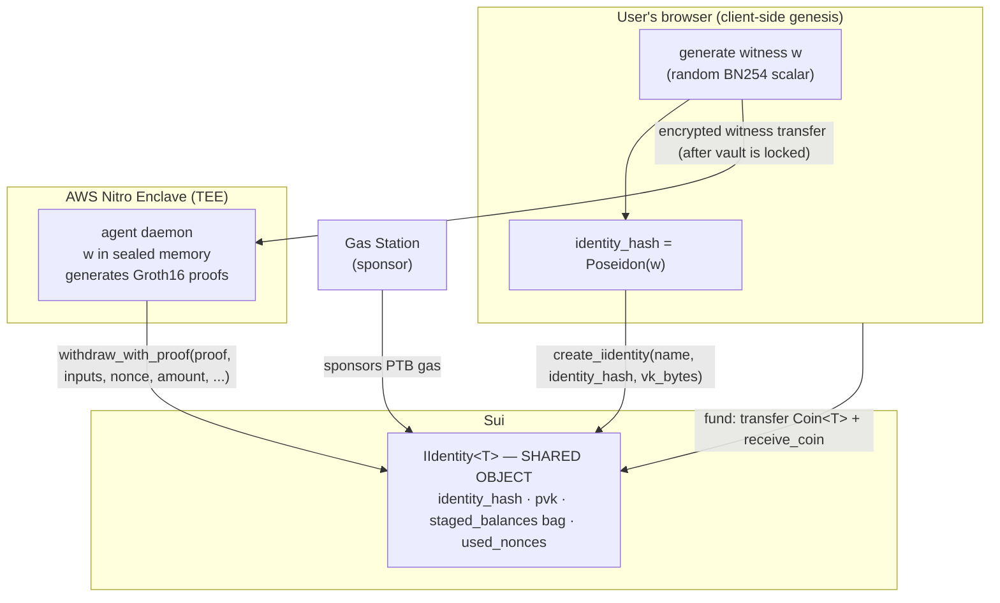

# I-Wallet — Delegation Model & Frontend Build Spec

How a user creates an iWallet and delegates it to an agent — and the concrete
plan for wiring Joseph's `frontend/` to Sui.

> **Scope.** The *architecture and crypto rationale* live in the root
> [`README.md`](../README.md) (client-side genesis, TEE, intent binding,
> sponsored PTBs). This document is the **build spec**: it maps that
> architecture onto specific frontend screens, Move calls, and an adapter
> contract, and records the gaps we have to close. Read the README first for
> the *why*; read this for the *how*.

---

## 1. Why this doc exists

The hackathon demo (`agent/setup-testnet.ts`) collapses **three distinct
actors into one `SUI_PRIVATE_KEY`**. That keypair currently acts as:

1. **Package publisher** — deploys the Move packages.
2. **The user** — splits SUI off its own balance and transfers it into the
   `IIdentity` object.
3. **The agent's tx sender** — signs every runtime bet PTB.

That conflation is a demo shortcut. The product model — and George's README —
requires these to be **separate actors with separate secrets**. The frontend
is what makes that separation real. This spec defines exactly how.

---

## 2. The three actors

| Actor | Holds | Can it drain the vault? | Where it runs |
|---|---|---|---|
| **User wallet** (Sui wallet / zkLogin) | Owns the funds originally; signs `create_iidentity` + funding txs | n/a — it's the owner | User's browser |
| **Agent** (TEE daemon) | The witness `w`, received over an encrypted tunnel | Only via a fresh, intent-bound Groth16 proof | AWS Nitro Enclave (TEE) |
| **Gas Station** (sponsor) | A funded keypair that sponsors PTB gas | **No** — sponsoring gas grants zero access to the vault | Our infra |

The critical property: **no single actor can move funds alone.** The vault
(`IIdentity`) releases coins *only* on a Groth16 proof of `w` bound to a
specific `(nonce, amount, recipient)`. The Gas Station pays fees but has no
proof. The user owns the funds but, once delegated, lets the agent act within
the mandate. `w` is the access token — and it lives inside the TEE, not on a
host an operator can read.



---

## 3. The Move contract surface (`sources/prototype.move`)

What the frontend actually calls. All functions are generic over the coin
type `T` (demo uses `0x2::sui::SUI`).

| Function | Kind | Frontend use |
|---|---|---|
| `create_iidentity<T>(name, identity_hash, vk_bytes, ctx)` | `entry` | **Create flow** — mints + shares the vault |
| `receive_coin<T>(identity, key, sent_coin)` | `public` | **Fund flow** — parks a transferred coin in `staged_balances[key]` |
| `staged_balance<T>(identity, key): u64` | `public` | **Read** — current balance for a key |
| `withdraw_with_proof<T>(identity, proof, inputs, nonce, amount, recipient, key, ctx): Coin<T>` | `public` | Agent runtime only — not called by the frontend |
| `withdraw_received_coin<T>(identity, sent_coin, recipient)` | `public` | Owner recovery path (no proof) |
| `get_iidentity_v2<T>(identity): address` | `public` | Read — object address helper |

### Gap: `IIdentity` is a **shared object with no owner field**

`create_iidentity` calls `transfer::public_share_object(identity)` — the vault
is shared, and the struct stores no creator/owner address. **Consequence:**
"list the iWallets that belong to me" cannot be a simple owned-object query.

Resolution:
- **v1 (frontend-only):** on `create_iidentity` success, store the created
  object id in `localStorage`, keyed by the connected wallet address. The
  `iwallets` list reads from there, then hydrates each from chain.
- **v2 (correct):** add an `IdentityCreated { id, creator }` event to the Move
  contract and index it via `queryEvents`. Needs a contract change — flag to
  George. Until then, v1 is the pragmatic path.

---

## 4. Frontend screen → Sui map

Joseph's screens in `frontend/src/app/`, and what each must do once wired.
`R` = read from chain, `W` = signed transaction, `—` = off-chain only.

| Screen | Op | What it does |
|---|---|---|
| `iwallets/page.tsx` (list) | R | Resolve the user's identity ids (localStorage v1), hydrate name + balance + status per object |
| `iwallets/create/page.tsx` | W | **Genesis**: generate `w` → `Poseidon(w)` → sign `create_iidentity` → persist id locally |
| `iwallets/[id]/page.tsx` (detail) | R | Object metadata, `staged_balance`, linked-agent status |
| `iwallets/[id]/fund/page.tsx` | W | Split a `Coin<T>`, `transferObjects` to the object id, then `receive_coin` |
| `iwallets/[id]/policy/page.tsx` | — | Mandate caps. **Off-chain only** — no on-chain mandate exists (see README §2 limits). Persist to agent config, not chain |
| `iwallets/[id]/agent/page.tsx` | — | Encrypted witness handoff. v1: download an agent config file containing `w`. v2: encrypt `w` to the TEE's attested pubkey |
| `iwallets/[id]/transactions/page.tsx` | R | `queryTransactionBlocks` touching the object id; cross-reference Walrus audit blobs |
| `dashboard/page.tsx`, `activity/page.tsx` | R | Aggregate views over the above |

---

## 5. Client-side witness generation

The genesis step, done entirely in the browser — `w` must never originate
server-side (that would be the custodial trap the README §1 calls out).

```
1. w  = a random scalar in the BN254 field  (32 bytes, rejection-sampled < r)
2. identity_hash = Poseidon(w)              (circomlibjs — already a dependency
                                             of agent/; port to the client)
3. encode identity_hash as 32 LE bytes      (matches the contract's expected
                                             public-input layout)
4. user signs create_iidentity(name, identity_hash, vk_bytes)
5. w is shown once as a recovery phrase / encrypted file, then handed to the
   agent. The user keeps a copy — it is their fund-recovery key.
```

`vk_bytes` is the Groth16 verifying key from the trusted setup
(`circuits/verification_key.json`), converted via the existing
`agent/src/vk.ts` logic — that converter must also be reachable client-side
(or the vk shipped as a static asset).

**Recovery:** because the user retains `w`, if the agent/TEE disappears they
can generate their own proof and call `withdraw_with_proof` directly. The
iWallet is never bricked by agent downtime.

---

## 6. The adapter contract

To swap screens off `demo-data.ts` with **zero UI changes**, the adapter
mirrors that file's exported shape (`IWallet`, `ProcessedTransaction`).

`frontend/src/lib/sui-client.ts`:

```ts
// Reads
listIdentities(owner: string): Promise<IWallet[]>
getIdentity(objectId: string): Promise<IWallet>
getStagedBalance(objectId: string, key: string): Promise<bigint>
getTransactions(objectId: string): Promise<ProcessedTransaction[]>

// Transaction builders (return a Transaction for the wallet to sign)
buildCreateIdentityTx(name: string, identityHashLE: Uint8Array, vkBytes: Uint8Array): Transaction
buildFundTx(objectId: string, key: string, amountMist: bigint): Transaction
```

Config (package ids, network) comes from `frontend/.env.local`, seeded from
the values `agent/setup-testnet.ts` already writes.

---

## 7. Implementation sequence

1. **Adapter + read path** — `sui-client.ts`, wire `iwallets` list and detail
   to real `IIdentity` objects. Lowest risk, fully testable, proves the
   wiring. (localStorage id store for the shared-object gap.)
2. **Wallet adapter** — integrate `@mysten/dapp-kit` for connect + signing.
3. **Create flow** — browser Poseidon, `create_iidentity`, persist id.
4. **Fund flow** — `transferObjects` + `receive_coin`.
5. **Agent handoff** — v1 config-file download of `w`.
6. **(Contract follow-up)** — `IdentityCreated` event so v2 listing is
   correct; raise with George.

Steps 1–2 are read-only/no-risk and unblock everything else. Steps 3–5 are the
write path and depend on the wallet adapter. Step 6 needs a Move change.

---

## 8. What this model deliberately does *not* claim

- **No on-chain mandate.** Policy caps (max stake, cooldowns, recipient
  whitelist) are enforced by the agent on itself, off-chain. The contract has
  no caps. Do not pitch "mandate enforced on-chain."
- **TEE protects `w` only once deployed.** The "compromised host can't drain
  funds" guarantee holds when the agent actually runs in the Nitro Enclave —
  not while it runs from a plain `.env`. See `HOSTING_AND_NAUTILUS.md`.
- **`recipient` is bound, not enforced.** `withdraw_with_proof` returns a
  `Coin<T>`; the intent hash pins `recipient` against cross-recipient replay,
  but the PTB caller chooses where the coin actually lands.

These are honest scoping lines, consistent with the README's own limits
section. Keep pitch language inside them.
