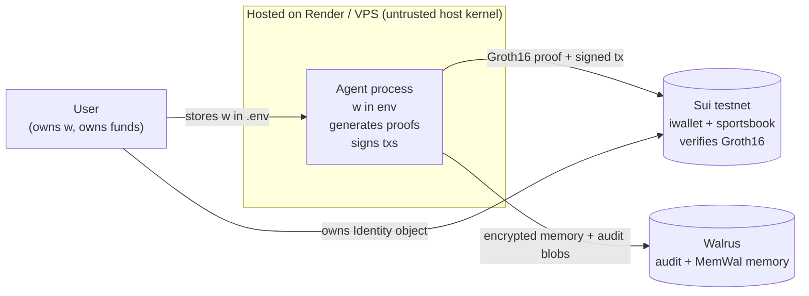
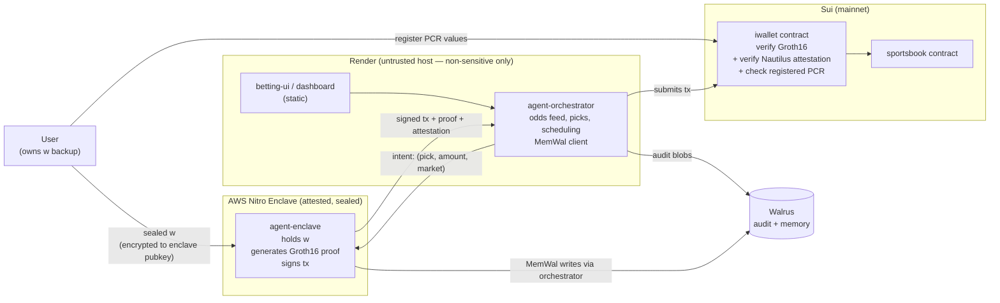
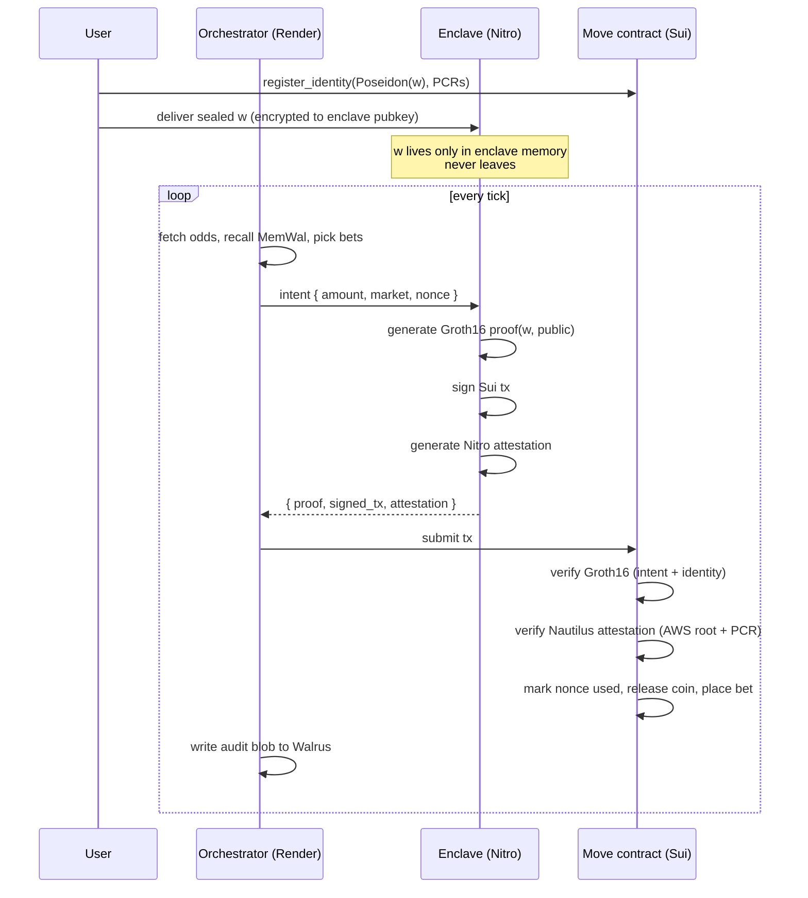

# I-Wallet — Hosting & the Nautilus Path

How we host the agent today, what's still missing for a real product, and the
production path via [Nautilus](https://docs.sui.io/concepts/cryptography/nautilus)
(AWS Nitro Enclaves verified on-chain by Move smart contracts).

> This document is forward-looking. It records architectural decisions and the
> path we *intend* to take post-hackathon. Claims about Nautilus integration
> below describe the **target state**, not what is currently deployed.

---

## TL;DR

- **Hackathon demo** runs the agent on a normal host (Render works fine, ~$7/mo).
  The agent process holds the witness `w` in memory — so a compromised host
  could drain the Identity. We call this **Threat B**.
- **Production path**: split the agent in two. The non-sensitive parts
  (orchestrator, UI, scheduling) stay on Render. The single process that
  touches `w` moves into an **AWS Nitro Enclave**, attested on-chain via
  Nautilus.
- This closes Threat B and makes *"compromised agent host can't drain your
  funds"* a defensible claim — the strongest version of the I-Wallet pitch.
- Render and Nautilus are **complementary, not alternatives**. Render hosts
  ~90% of the stack; the Nitro enclave is the locked safe for the one secret.

---

## Current state (hackathon demo)

**Threats covered by the proof system alone:**
- Replay: single-use nonces, enforced on-chain.
- Intent binding: every proof commits to `(amount, recipient)` via
  `keccak256` recomputed on-chain.
- Identity binding: proof must satisfy `Poseidon(w) == identity_hash`.

**Threats *not* covered (today):**
- **Threat B** — host operator or anyone with shell on the agent host can read
  `w` from process memory and drain the Identity within the mandate window.
- **Threat A/C** — ~~mandate caps are off-chain policy~~ **resolved 2026-05-24**:
  budget cap, recipient whitelist, and expiry are now enforced on-chain by
  `AgentPolicy` in `withdraw_with_proof` (`5af56cc`).

> See [`security-concerns-deferred`](../) (internal) for the full deferred list.

---

## Target state (Render + Nautilus)

The proof system is **unchanged**. Nautilus adds *an additional gate* in Move:
the contract verifies the AWS Nitro attestation (AWS root CA chain + PCR
values) before accepting the tx. PCRs are registered on-chain at Identity
creation and bound to the Identity, so only the attested binary can act.

### Place-bet sequence (target)

---

## Component placement

| Component | Lives on | Holds secrets? | Notes |
|---|---|---|---|
| `betting-ui/` (Vite) | Render Static | No | Public site, anyone can load |
| `frontend/` (Next.js dashboard) | Render Static | No | Joseph's management UI |
| `agent-orchestrator/` | Render Web Service | No | Odds feed, picks, MemWal client, scheduling, Walrus writes |
| `agent-enclave/` | AWS Nitro Enclave | **Yes (w)** | Minimal: receive intent → proof + signed tx |
| MemWal relayer | mysten-incubation or self-host | No | Encrypted writes; user-owned keys |
| Walrus | Decentralized | No | Audit blobs + MemWal storage |
| Sui RPC | Public / Shinami / Triton | No | Testnet free; mainnet paid |
| Odds feed | the-odds-api.com | No | Paid subscription |
| Circuit artifacts | Static CDN | No | `iwallet.wasm`, `iwallet_final.zkey` |
| Move contracts | Sui chain | n/a | Already deployed (testnet) |

Rule of thumb: **only `w` + proof generation + tx signing lives in the
enclave. Everything else lives on Render.** Enclaves are expensive per
CPU-hour, and a small enclave surface keeps reproducible builds tractable and
PCR values stable.

---

## Threat model — before / after

| Threat | Today (Render only) | With Nautilus |
|---|---|---|
| Agent never holds keys to your wallet | ✅ proof-bound | ✅ |
| Replay-safe (single-use nonces) | ✅ | ✅ |
| Intent-bound (amount, recipient) | ✅ | ✅ |
| Encrypted, owner-controlled memory | ✅ (MemWal/SEAL) | ✅ |
| **Compromised host can't drain funds** (Threat B) | ❌ host reads `w` | ✅ `w` sealed in enclave |
| Code is attested and tamper-evident | ❌ | ✅ via PCR on-chain |
| Mandate caps enforced on-chain (budget/scope/expiry) | ✅ on-chain `AgentPolicy` (5af56cc) | ✅ |
| AWS / Nitro is in trust root | n/a | ⚠️ yes — residual trust |

Nautilus closes the host-trust problem (Threat B). Mandate enforcement
(Threat A/C) is handled separately and is now **on-chain** via `AgentPolicy`
(budget / recipient whitelist / expiry) as of `5af56cc`.

---

## Open design choices

### 1. How does `w` get into the enclave?

**(a) Sealed delivery (recommended)**
The user generates `w` client-side, encrypts it to the enclave's attested
public key, and sends the sealed blob. The user keeps their copy and can
recover on enclave loss.

**(b) Enclave-generated `w`**
The enclave generates `w` itself and exports only `Poseidon(w)`. Stronger
isolation — `w` literally never exists outside the enclave — but losing the
enclave loses the Identity unless we add an attested backup scheme
(e.g. Shamir-split across multiple attested enclaves).

→ **Picking (a)** for v1. User retains the recovery key; matches the broader
"your wallet, your agents" model.

### 2. Required vs optional Nautilus

**Required**: Move contract checks attestation alongside the Groth16 proof
on every tx. Strongest claim — *every* I-Wallet user gets host-safety. But
locks out self-hosted users who can't or won't run a Nitro enclave.

**Optional, per-mandate flag**: Identity carries a flag at creation — `"self-
hosted"` or `"hosted-attested"`. Self-hosted Identities skip the attestation
check; hosted ones require it. Best UX, claim becomes
*"hosted-attested via Nautilus"* (which is still strong).

→ **Picking optional** for v1. Add the flag at `register_identity` time;
default to attested for the managed product.

### 3. Multi-tenant enclave vs one-per-user

**One enclave per user**: cleanest blast radius, ~$170/mo per agent.
**Multi-tenant**: one Nitro VM serving N users with in-enclave isolation
(separate keypairs, per-user Identities). Cheaper, ~$170/mo amortized.

→ Start one-per-user for v1 (simpler audit), move to multi-tenant once the
isolation design is reviewed.

---

## Cost reality

| Component | ~$/mo | Notes |
|---|---|---|
| Render Web Service (orchestrator) | $7–25 | Starter $7, autoscale $25 |
| Render Static (UI) | $0 | Free tier |
| AWS m5n.large (Nitro-capable, idle) | ~$140 | One enclave |
| AWS m5n.large (24/7) | ~$170 | Per-host, supports multi-tenant |
| AWS m5n.xlarge | ~$340 | If you need more memory headroom |
| Marlin Oyster (managed Nitro-on-Sui) | similar range | Less ops overhead |
| Sui RPC (mainnet, prod traffic) | ~$50–200 | Shinami / Triton / Blockvision |
| Odds feed (the-odds-api.com) | $30–120 | Tier-dependent |
| Walrus | pay-per-blob | Tiny per-bet cost |
| MemWal staging | $0 | While in incubation |

**Hackathon / pilot total: ~$10–30/mo + odds feed.**
**Production per agent (one enclave): ~$200–400/mo amortized over multi-tenant users.**

---

## Migration sequence

1. **Now → submit (June 21)** — stay on Render only. Add this doc + diagram so
   the pitch can say *"hosted-attested via Nautilus is the production path"*
   without overclaiming current state.
2. **Submit → +2 weeks** — port `agent-enclave` to a Nitro enclave on
   [Marlin Oyster](https://blog.marlin.org/scaling-confidential-compute-on-sui-nautilus-and-marlin-oyster-integration)
   (fastest path; they already have Nautilus integrated for Sui). Reproducible
   build, register PCRs on-chain, sealed-delivery prototype.
3. **+2 → +6 weeks** — add Move-side Nautilus attestation verifier as an
   *optional* gate (mandate flag). Self-hosted users skip; hosted users
   require attestation.
4. **+6 weeks → mainnet** — multi-tenant enclave hardening, on-chain mandate
   caps (closes Threats A/C), recovery flow for sealed `w`.

---

## What we are *not* changing

- The proof system: Groth16 over BN254, generated via snarkjs, verified
  natively by `sui::groth16`. Unchanged.
- Identity model: `IIdentity` object on-chain, `Poseidon(w) == identity_hash`,
  single-use nonces. Unchanged.
- Walrus + MemWal for audit and memory. Unchanged.
- The off-chain mandate concept (caps, cooldowns) still applies; Nautilus
  doesn't replace it, on-chain enforcement does.

Nautilus is an **additive** layer: a stronger host-trust assumption gated by
on-chain attestation. The Move contract verifies *both* the Groth16 proof
*and* the attestation; either failing aborts the tx.

---

## Sources

- [Nautilus — Sui Documentation](https://docs.sui.io/concepts/cryptography/nautilus)
- [Using Nautilus — Sui Docs](https://docs.sui.io/guides/developer/nautilus/using-nautilus)
- [Nautilus Design — Sui Docs](https://docs.sui.io/concepts/cryptography/nautilus/nautilus-design)
- [MystenLabs/nautilus on GitHub](https://github.com/MystenLabs/nautilus)
- [Sui Blog — Tamper-Proof Oracles with Nautilus](https://blog.sui.io/nautilus-tamper-proof-oracles/)
- [Marlin Oyster × Nautilus on Sui](https://blog.marlin.org/scaling-confidential-compute-on-sui-nautilus-and-marlin-oyster-integration)
- [AWS Nitro Enclaves — Root of trust](https://docs.aws.amazon.com/enclaves/latest/user/verify-root.html)
