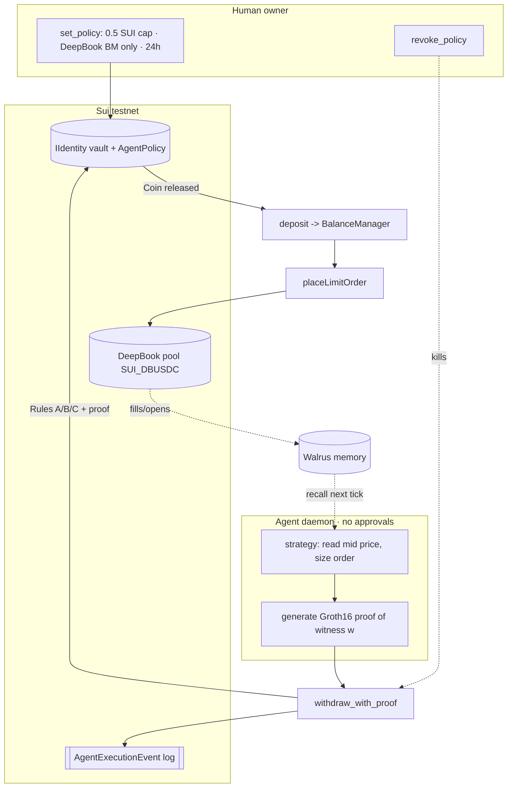

# Sub-track 2 — Autonomous Agent Wallet × DeepBook (runbook)

The full self-driving loop: an AI agent is granted a capped, time-boxed, DeepBook-only
budget by an on-chain `AgentPolicy`, then **autonomously** extracts funds (ZK-proof gated,
no human signature) and places **real DeepBook orders** — every action logged on-chain, and
the owner can **revoke** instantly.

## How each "must have" is satisfied

| Requirement | Where |
|---|---|
| **Real DeepBook orders** | `agent/src/deepbook.ts` → `depositIntoManager` + `placeLimitOrder` (proven by the spike, tx `6SSiue…`) |
| **Self-enforced budget ceiling** | `prototype::withdraw_with_proof` Rule B: `amount_spent + amount <= budget_cap`; also expiry (Rule A) + DeepBook-only recipient (Rule C) |
| **On-chain activity log** | `AgentExecutionEvent { identity_id, nonce, amount, recipient, coin_type }` emitted on every withdrawal; DeepBook order events on top |
| **Owner revocation demo** | `prototype::revoke_policy` (owner-gated) → `npm run revoke`; the next `withdraw_with_proof` aborts with `EPolicyExpired` |
| **No human in the loop** | the agent holds the witness `w` + its `IWalletOwner` cap and signs with its own key; spending is bounded by the policy, not by approvals |

## Architecture



## One-time setup

Prereqs: `agent/.env` has `SUI_PRIVATE_KEY` (funded testnet key) and `AGENT_WITNESS_W`.
Install the new dep (regenerates the lockfile for your platform):

```bash
cd agent && npm install        # pulls @mysten/deepbook-v3
```

### 1. Create the DeepBook BalanceManager
```bash
npm run setup:deepbook
# -> prints BALANCE_MANAGER_ID=0x…  (add it to agent/.env)
```

### 2. Provision the iWallet, scoped to that manager
The policy whitelists **only** the BalanceManager as a recipient — that's the
"DeepBook only" protocol scope.
```bash
POLICY_ALLOW_RECIPIENTS=<BALANCE_MANAGER_ID> \
POLICY_BUDGET_MIST=500000000 \
POLICY_TTL_MS=86400000 \
IWALLET_PACKAGE_ID=0x73b685d06ccc1c1144bf10c3a13d9cbe22315a519d2f1f4c21f4255b4bda83d9 \
npm run provision
# -> prints IIDENTITY_OBJECT_ID and IWALLET_OWNER_ID (add both to agent/.env)
```

### 3. Fund the vault
George's transfer-to-object model — send SUI straight to the IIdentity address:
```bash
sui client transfer-sui --to <IIDENTITY_OBJECT_ID> --amount 600000000 --gas-budget 5000000
```

Resulting `agent/.env` keys for the loop:
```
IWALLET_PACKAGE_ID=0x73b685d06ccc1c1144bf10c3a13d9cbe22315a519d2f1f4c21f4255b4bda83d9
IIDENTITY_OBJECT_ID=0x…
IWALLET_OWNER_ID=0x…
BALANCE_MANAGER_ID=0x…
AGENT_WITNESS_W=…           # secret — never commit
IDENTITY_HASH=0x…           # optional sanity check = Poseidon(w) LE
# strategy knobs (optional): TRADE_QTY, TRADE_SIDE, TRADE_PRICE, TRADE_OFFSET_PCT
```

## Run the loop

```bash
npm run trade
```
Each tick: recall memory → read mid price → `withdraw_with_proof` (policy gate, emits
the event) → deposit + `placeLimitOrder` → remember the trade. Prints both tx digests +
a suiscan link for the DeepBook order.

## Demonstrate revocation

```bash
npm run revoke      # owner extracts the policy
npm run trade       # next tick: withdraw_with_proof aborts (EPolicyExpired) -> no order
```

## Demonstrate the budget ceiling

Set `POLICY_BUDGET_MIST` low (e.g. `1500000000` = 1.5 SUI) and run `npm run trade` repeatedly.
Once cumulative `amount_spent + amount` would exceed the cap, the withdrawal aborts with
`EBudgetExceeded` — the agent cannot spend past its mandate even though its keys still work.

## Notes / hardening

- **Two-transaction flow:** withdrawal (TX1) and deposit+order (TX2) are separate. The budget,
  recipient scope, and on-chain log are all enforced in TX1; the released coin transits the
  agent wallet for ~1 tx before landing in DeepBook. Folding both into one atomic PTB (deposit
  the withdrawn `Coin` object directly) is the next hardening step — it removes that transit and
  makes "funds can only reach DeepBook" atomic.
- **Strategy v1** places a resting order away from mid (won't cross) so the demo is safe and the
  order is visible + cancellable. Swap in a real fill strategy for the live demo.
- **Witness/registration:** the agent provisions and withdraws with the same `circomlibjs`
  Poseidon, so the proof verifies. A frontend-created iWallet (poseidon-lite) must match this —
  see the Poseidon cross-check task before mixing the two.
