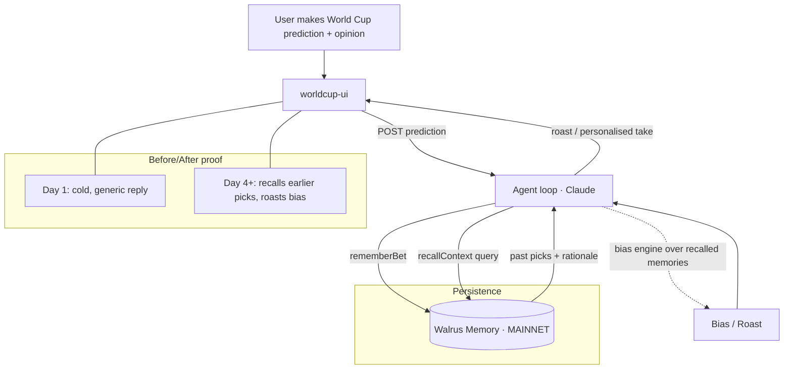

# Walrus Sessions 4 — World Cup Memory Agent (scope)

> **Status:** scoping only. Nothing built yet. For review with George before we commit
> the team to a second hackathon track.
> **Challenge:** Walrus Sessions 4 — build an AI agent with *persistent memory* across
> sessions, themed on the FIFA World Cup, using **Walrus Memory (MemWal)** on **Walrus Mainnet**.
> **Prize:** $2,000 WAL (1st $500 … 5th $100, + feedback/special prizes).
> **Window:** Jun 5 → **Jun 24** submit · results Jul 2. **As of today (Jun 8) we have 16 days.**
> **Submit:** Airtable form · demo video < 3 min · before/after memory proof · GitHub issues for bugs.

## TL;DR — why this is a low-risk second track for us

We are **not** starting from zero. The I-Wallet agent already has a working Walrus memory
layer (`agent/src/memwal.ts`: `rememberBet` / `recallContext`) **and** a finished sports
prediction UI (`betting-ui/`, soccer markets with draw odds, agent-pick feed with rationale +
tx digest). The challenge's single judging criterion — *"pull something from an earlier session
and use it to say or do something it couldn't have on day one"* — is exactly what `recallContext`
already enables. The work is **theming + a mainnet config + a visible before/after**, not a new agent.

## What the judges actually score (from the brief)

1. **Real persistence across sessions** — day-1 vs day-4+ behaviour must visibly differ.
2. **It uses the memory** — recalls an earlier prediction/opinion and acts on it.
3. **Before/after demo** — a clear day-1 vs day-4 side-by-side in a < 3 min video.
4. **Built on Walrus Mainnet** with Walrus Memory (not staging).

Idea the brief explicitly floats: **"Prediction Roast — tracks your picks and roasts your biases
in real time."** That maps directly onto what we already store (every pick + rationale).

## What we reuse vs build

| Piece | Reuse / Build | Notes |
|---|---|---|
| Walrus memory layer | **Reuse** `agent/src/memwal.ts` | `rememberBet`, `recallContext` already work |
| Memory shape | **Extend** `BetMemory` | add `matchday`, `confidence`, `result` (won/lost) so bias is computable |
| Prediction UI | **Fork** `betting-ui/` → `worldcup-ui/` | keep betting-ui untouched (per direction); World Cup markets + a "What the agent remembers about you" panel |
| Agent loop | **Reuse** harness `/state` shape | feed World Cup fixtures instead of generic odds |
| "Roast"/bias engine | **Build (small)** | derive bias from recalled memories (e.g. "you keep backing favourites and losing") |
| Mainnet config | **Build (config)** | `MEMWAL_SERVER_URL` → mainnet relayer, `MEMWAL_NAMESPACE` = `worldcup-<user>` |

**Net-new code is small:** memory-shape extension, a bias/roast function over recalled
memories, World Cup fixture data, and one UI panel surfacing recalled memories + the roast.

## Minimum viable submission (the cut line)

A loop that, per matchday:
1. Takes the user's prediction + a one-line opinion → `rememberBet` to Walrus mainnet.
2. On a later session, `recallContext("user's biases / past <team> picks")` → feeds Claude.
3. The agent says something **only possible because it remembered** — e.g.
   *"Last week you swore Brazil were unbeatable after they scraped a 1–0. You're 1–3 on
   'lock' picks. Sure about backing them again?"*
4. UI shows a **Day 1** card (cold, generic) next to a **Day 4** card (personalised from memory).

That before/after pair *is* the demo.

## Architecture

## 16-day timeline (Jun 8 → Jun 24)

| Days | Work |
|---|---|
| Jun 8–10 | Confirm MemWal **mainnet** relayer + account creds; extend `BetMemory` (matchday/confidence/result); prove remember→recall roundtrip on mainnet |
| Jun 11–14 | Fork `betting-ui` → `worldcup-ui`; World Cup fixtures; "What the agent remembers" panel |
| Jun 15–18 | Bias/roast function over recalled memories; wire into agent reply; Day-1 vs Day-4 states |
| Jun 19–21 | Polish, seed a multi-day memory trail, record < 3 min before/after video |
| Jun 22–24 | Submit Airtable form, file GitHub issues for any MemWal bugs (scored), buffer |

> Note: I-Wallet functional freeze is **Jun 15** and submit **Jun 21** (see roadmap). This track
> overlaps that crunch — it's only worth taking if it largely **reuses** the existing agent, which
> is the whole premise above. If it starts requiring net-new agent work, drop it.

## Open questions for George

1. Do we have a **Walrus mainnet** MemWal account / relayer URL, or only the staging relayer
   (`relayer.staging.memwal.ai`) the agent points at today? Mainnet is a hard requirement.
2. OK to spin a **separate `worldcup-ui`** (fork of betting-ui) rather than touch betting-ui? (Per
   current direction: yes — keep betting-ui and the DeepBook CLI untouched.)
3. Who records/narrates the < 3 min video?
4. Is the small team bandwidth there given the Jun 15 freeze, or do we submit World Cup *after*
   the main I-Wallet submission (Jun 21) using the remaining Jun 22–24 window?

## Decision

This is a **high-leverage, low-net-new-code** second track *because* the memory layer and prediction
UI already exist. Recommend a **timeboxed go** contingent on a mainnet MemWal account existing
(question 1). If mainnet access is blocked, it's not submittable — don't start.
